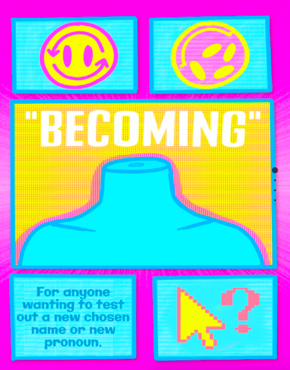

## Notes
_App will be ready to launch around the end of Febuary 2022._ 
 
## Description
`"becoming" is a webapp for LGBTQ+ people trying to find their na(me) or pronouns through testing.` I created this app because changing your name and/or pronouns is a beautiful affirmation for most people, but sometimes it can be a very dangerous step to take. On average, most trans people don't live past 30 years, so this app is an attempt to try to prevent that for younger trans (and queer) people, ___especially those who may have less safety in testing out new names or new pronouns.**___ 

## Features
Users can sign in or sign up for a profile that stores a list of their names and/or pronouns they are considering using. `When a user enters the name/pronoun to "try out", the app will generate writing examples where that name and/or pronoun is used.` If the user feels it looks "right," they can star those names/pronouns, or cross others out. If the user is inbetween names (like I once was), and has trusted people - they can tally up the votes for which names their friends prefer, and make an informed decision afterwards. 

## How it'll be made
> Made using SCSS, Javascript, Node.js, JSON, Express, EJS, and User Authentification using passport.

